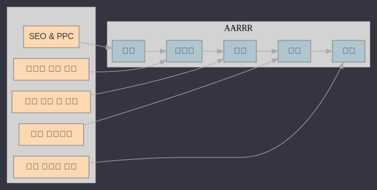

# Online Practical AB Test

### 데이터사이언스실 9강 곽지호

---

## 1. 통계기반 온라인 AB테스트가 중요한 이유

- ### 숙박 중개 서비스 마케팅 예시 (AARRR 관점)
  
___

- ### 숙박 중개 서비스 앱UX 예시 (퍼널 관점)
  - 퍼널 : 온라인 비즈니스의 경우, 구매 전환까지 가는 길목
  
  - 외부광고노출 ➡️ 서비스 진입 ➡️ 카테고리 조회 / 검색 ➡️ 상품 목록 조회 ➡️ 장바구니 추가 ➡️ 결제 페이지 진입 ➡️ 결제 완료 ➡️ (취소 / 환불)
  - 퍼널구간별 통계적 실험설계를 통해 UX나 상품구성, 문구 등을 데이터 기반 의사결정을 유도

---

## 2. 통계기반 온라인 ABTEST 퍼널별 실험 예시(1)

__(외부광고 노출)__ 
  SEO 설정에 따른 진입율 차이는?

__(서비스 진입)__  
  ATF(Above the fold) 영역에 프로모션 배너가 좋은지 베스트셀러 상품리스트를 보여주는게 좋은지?
__(카테고리 조회 / 검색)__ 
  카테고리 배열이 방법은 무엇이 최적인가?
__(상품 조회)__ 
  상품 정렬 알고리즘 최적화 방법은 무엇이 최적인가?

---

## 2. 통계기반 온라인 ABTEST 퍼널별 실험 예시(2)
__(장바구니 추가)__ 
    장바구니를 추가를 유도하는게 구매전환에 좋은지? 바로 구매를 유도하는게 좋은지?

__(결제 페이지)__ 
    결제 수단은 여러가지가 있는게 좋은지? 카드결제만 하는게 좋은지?
__(결제 완료)__ 
    결제 완료후, 추가구매를 유도할때, 관련 상품을 보여주는게 좋은지, 홈화면으로 리다이렉션을 하는게 좋은지?
__(결제 취소)__ 
    결제 취소시, 취소 여부 확인 다이얼로그를 보여주는게 좋은지, 즉각적인 취소 처리로 편의성을 도모하는게 좋은지?

---

## 3. 빅테크의 ABTEST 사례

---

## 구글
  검색 결과 페이지의 디자인을 개선하기 위해 41가지의 다른 색상 파란색을 테스트함. 
  이 작은 변화가 사용자의 클릭률을 증가시켰고, 결과적으로 수익 증대로 이어짐.

---

## 아마존
  상품 페이지의 레이아웃 변경이 구매 전환율에 미치는 영향을 분석하여 더 많은 매출을 기록.

---

### 페이스북
콘텐츠 표시 알고리즘의 변화를 A/B 테스트로 평가함. 
사용자의 피드에 어떤 종류의 콘텐츠를 더 자주 또는 덜 자주 보여줄지 결정하기 위해 다양한 버전을 테스트하여 사용자 참여도를 높임.

---

### 넷플릭스
사용자 인터페이스 및 추천 시스템의 변화를 평가하기 위해 A/B 테스트를 사용. 
예를 들어, 다른 썸네일 이미지를 테스트하여 어느 이미지가 더 많은 클릭을 유도하는지 분석하고, 
그 결과를 바탕으로 콘텐츠의 보이는 방식을 최적화 진행.

---

### Booking.com
웹 페이지의 다양한 요소를 A/B 테스트하여 사용자 경험을 향상시키고 예약률을 높임. 
예를 들어, 호텔 방의 예약 버튼 크기와 색상, 페이지 레이아웃의 변화 등이 사용자의 예약 결정에 큰 영향을 미칠 수 있음.

---

## 4. 생각해볼 문제(1)

### (실험설계)

- 실험은 몇명을 대상으로 해야하는가?

- 실험 기간은 얼마나 해야 하는가?
- 실험군과 제어그룹의 수는 어느정도가 좋은가?
- 각 사용자는 어떻게 실험군에 편성해야 하는가?
- 실험을 진행하기 위해 어떤 지표를 선정해야하는가?
- 실험결과 알고리즘은 무엇을 사용해야하는가?

---

## 4. 생각해볼 문제(2)

### (결과분석)

- 실험 결과를 어떻게 해석해야하는가?

- 결론을 못냈을 경우, 실험을 폐기해야 하는가? 한번더 해봐야 하는가?
- 실험의 내용이 비즈니스적인 손실이 있을때, 언제 중단하는게 맞는가?

---

## 5. ABTEST 기초개념

### (1) 기본 단계

- 목표 설정

  - 테스트의 목적을 명확히 하고, 무엇을 측정할지 결정.

  - (ex) 웹페이지에서의 클릭률, 구매 전환율, 또는 사용자의 체류 시간 등

- 가설 수립

  - 일반적으로 "버전 B는 버전 A보다 더 나은 성능을 보일 것이다"와 같은 가설을 설정.

  - 이 가설은 테스트의 결과를 예측하고, 이를 검증하는 데 사용됨.

---

- 대상 그룹 분할

  - 사용자를 무작위로 두 그룹(A와 B)으로 나누어 각 그룹에게 다른 버전을 제공.
  - 이렇게 함으로써 외부 요인의 영향을 최소화하고 두 버전의 차이가 실제 효과 때문인지를 판단하게됨.

- 실험 실행

  - 두 버전을 동시에 실행하여 데이터를 수집.

  - 이 단계는 충분한 데이터를 확보할 때까지 계속됨.

- 데이터 분석

  - 수집된 데이터를 분석하여 어느 버전이 더 나은 성능을 보이는지 통계적으로 검증함.

  - t-검정, z-검정 등의 통계 검정 방법을 사용할 수 있음.

---

### (2) 실험 변수의 타입에 따른 차이

- 이산형 변수

  - 실험 변수가 카테고리형 데이터를 가지고 있음.

  - (ex) 구매여부, 클릭여부, 이탈여부, 재방문여부
  - 통계 검정 방법 : 두 비율 검정, 카이제곱 검정, Fisher 정확 검정(Fisher's Exact Test)

- 연속형 변수

  - 실험 변수가 수치형 데이터를 가지고 있음.

  - (ex) 구매 금액, 체류 시간, 객단가
  - 통계 검정 방법 : t-검정, ANOVA, MANOVA

---

### (3) 최소 감지 효과(MDE)

- 효과 크기(Effect Size)

  - 두 집단 간의 차이나 상관관계의 크기를 수치적으로 표현

  - 즉, 실험의 결과가 실제로 얼마나 의미 있는지를 나타내는 척도
  - (ex) 두 치료법의 효과 차이, 교육 방법의 성과 차이 등
  - 일반적인 효과 크기 지표로는 Cohen's d, Pearson's r 등
  - 효과 크기가 크면 클수록, 실험 결과의 실제적 중요성이 높음

---

- 최소 감지 효과(MDE)

  - 유의미한 차이를 감지하기 위해 최소한 필요한 효과 크기를 의미

  - 샘플사이즈를 계산할때 활용함.

---

- MDE 설정 방법 (애매하고 주관적인 영역)

  - 실험의 목적과 문맥 파악

    - (ex) 전환율을 현재의 2%에서 2.5%로 25% 증가시키는 것이 비즈니스 목표일 수 있음.

  - 이전 데이터 참고
    - 현재상황의 평균 전환율을 분석하여 효과 크기의 초기 추정치를 설정
  - 리소스의 제한 고려
    - 예산, 시간, 사용 가능한 트래픽 양 등을 고려하여 현실적인 범위 내에서 결정
  - 기타 방법
    - 유사 산업 또는 경쟁사에서 보고된 전환율 개선 사례를 참고
    - 파일럿 테스트로 예상 효과 가늠
    - 통계적 자문
  
---
## 이산형 변수 Effect Size 산출 공식

 

$$
cohen's\, h

= 2 \cdot \arcsin(\sqrt{p1}) - 2 \cdot \arcsin(\sqrt{p2})

$$
 

## 연속형 변수 Effect Size 산출 공식

 

$$
cohen's\, d

= \frac{\mu_1 - \mu_2}{s}

$$

---

### (4) 유의수준

- 유의 수준(Significance Level, α)

  - 유의 수준 설정은 연구의 엄격함을 결정하는 중요한 요소

  - 통계적 가설 검정에서 귀무 가설을 잘못 기각할 위험을 감수하는 최대 확률
  - 즉, 유의 수준을 설정함으로써, 귀무 가설이 사실일 때 이를 잘못 기각할 가능성을 정의

- 유의 수준 설정 방법 (산업별 표준)

  - 일반적으로 0.05(5%) 또는 0.01(1%)로 설정

  - 유의 수준이 낮을수록 결과가 우연에 의한 것이 아니라는 확신이 높아짐

---

- 결론

  - 효과 크기와 유의 수준은 실험의 설계와 해석에서 중요하게 고려됨.

  - 효과 크기는 실험의 실질적 중요성을,
  - 유의 수준은 결과의 통계적 신뢰성을 각각 나타냄.
  - 이 두 매개변수는 검정력과 밀접하게 연관됨

---

### (5) 통계 검정력

- 정의:

  - 통계적 가설 검정에서 귀무 가설이 거짓일 때 이를 기각할 확률,

  - 즉, 실험에서 실제 효과를 놓치지 않고 정확하게 감지하는 능력

- 중요성

  - 낮은 검정력: 실제 효과를 감지 못하고 귀무 가설을 잘못 채택할 위험 증가

  - 높은 검정력: 귀무 가설이 거짓일 때 이를 정확히 기각할 확률이 높아, 실제 차이를 더 잘 포착
  - 설계 단계에서 필요한 최소 표본 크기 추정하는데 활용

---
### (5) 통계 검정력

- 요소별 영향

  - 표본 크기(n): 표본 크기가 클수록 검정력 증가

  - 효과 크기(effect size): 효과 크기가 클수록 검정력 증가
  - 유의 수준(α, alpha): 유의 수준이 높을수록 검정력 증가하지만, 오류 발생 가능성도 증가

---

### (6) 1종 오류와 2종 오류

- __1종 오류 (Type I error)__

  - 정의: 참인 귀무 가설을 잘못 기각하는 오류

  - 예시: 실제로 효과가 없음에도 불구하고 효과가 있다고 잘못 판단하는 경우.
  - 유의 수준 (α): 1종 오류를 범할 확률로, 일반적으로 0.05 (5%)로 설정됨

---

  - **1종 오류를 신경써야하는 사례** 
    - (비용을 낭비하거나, 고객 불만족으로 이어지는 경우들)

    - 온라인 광고 캠페인
      - 기업이 새로운 광고 전략을 테스트하고 있는데, 효과가 없는 전략을 효과적이라고 잘못 결론 내리면, 비용과 자원의 낭비로 이어질 수 있음. 또한 장기적으로는 브랜드 가치나 시장 점유율에 부정적 영향을 줄 수 있어, 잘못된 전략을 중단하고 정확한 결론을 내리는 것이 중요함.

    - 웹사이트 디자인 변경
      - 웹사이트의 사용자 경험을 개선하기 위해 새로운 디자인을 도입했을 때, 실제로는 효과가 없거나 부정적인 영향을 미치는 디자인을 성공적이라고 판단하면 사용자 만족도 감소와 이탈률 증가로 이어질 수 있음.

---

- __2종 오류 (Type II error)__

  - 정의: 거짓인 귀무 가설을 잘못 채택하는 오류

  - 예시: 실제로 효과가 있음에도 불구하고 효과가 없다고 잘못 판단하는 경우.
  - 검정력 (1 - β): 2종 오류를 범하지 않을 확률로, 일반적으로 0.8 (80%)을 목표

---

  - **2종 오류를 신경써야하는 사례** (시장 기회를 놓치는 경우들)

    - 이메일 마케팅 전략: 새로운 이메일 마케팅 캠페인을 평가할 때, 실제로는 효과가 있는 캠페인을 효과가 없다고 잘못 판단하면, 매출 증대와 고객 관계 강화라는 기회를 놓칠 수 있음. 따라서 캠페인의 잠재력을 놓치지 않도록 2종 오류를 줄이는 것이 중요함.

    - 제품 가격 조정: 가격 조정이 실제로 판매량이나 고객 만족도에 긍정적인 영향을 미칠 수 있는데, 그 효과를 감지하지 못하고 기존의 가격 정책을 유지하는 경우, 추가 수익이나 시장 점유율 확대 기회를 잃을 수 있음.

---
### 결론

  - 1종 오류와 2종 오류 사이에는 상충 관계가 존재.

  - 1종 오류의 확률을 낮추면 2종 오류의 확률이 높아짐.

  - 반대로 2종 오류의 확률을 낮추면 1종 오류의 확률이 높아짐.

  - 따라서 통계적 검정을 설계할 때는 이 두 오류의 균형을 고려해야함.

---

### (7) p-value

- 데이터가 귀무 가설을 지지하는 증거의 강도를 나타냄.

- p-value가 작을수록, 우리가 관찰한 데이터가 귀무 가설 하에서 발생할 가능성이 낮음을 의미함.
- 일반적으로 p-value가 작다는 것은 관찰된 효과가 우연이 아니라 실제 차이 때문일 가능성이 높음을 나타냄.

---

### (8) 메트릭별 상관관계

| 변경 변수        | 샘플사이즈 ↑ | 샘플사이즈 ↓ | 표준편차 ↑ | 표준편차 ↓ | 유의수준 ↑ | 유의수준 ↓ | MDE ↓ | MDE ↑ |
| --- | --- | --- | --- | --- | --- | --- | --- | --- |
| **검정력**       | ↑            | ↓            | ↓          | ↑          | ↓          | ↑          | ↑              | ↓              |
| **샘플사이즈**   | -            | -            | ↑          | ↓          | ↑          | ↓         | ↑               | ↓              |
| **표준편차**     | ↓            | ↑            | -          | -          | ↓          | ↑          | -              | -              |
| **유의수준**     | 감지 능력 ↓  | 감지 능력 ↑  | 1종 오류 ↑ | 1종 오류 ↓ | -          | -          | -              | -              |
| **MDE** | ↓            | ↑            | ↓          | ↑          | -          | -          | -              | -              |

---

### (9) 단측검정과 양측검정, 그리고 비열등성 테스트
---

### 단측검정
  - 정의
    - 기대하는 대안 가설의 목표 메트릭이 방향성을 가지면서 유의한 차이를 나타내는지 검증하고자 할때 수행하는 테스트
  - 예시
    - 로그인 수단에 카카오 소셜로그인을 추가하면 기존 로그인 방식보다 회원가입률이 증가할 것이라는 가설 테스트
    - 귀무가설(H0): 카카오 소셜로그인이 추가된 로그인의 회원가입율 ≤ 기존 로그인 수단의 회원가입율
    - 대립가설(H1): 카카오 소셜로그인이 추가된 로그인의 회원가입율 > 기존 로그인 수단의 회원가입율

---

### 단측검정
  - 활용
    - 샘플사이즈 확보의 제한을 받는 상황이거나, 각 트리트먼트 효과의 방향성에 대한 확신을 가지고 있는 상황
  - 한계
    - 대안가설의 우월성만 테스트 할수 있고, 열등성을 보이는지 확인할수 없어, 비즈니스적 리스크를 안고 있음

---

### 양측검정

  - 정의
    - 기대하는 대안 가설이 대립 가설의 메트릭과 유의한 차이가 있는자만 테스트

  - 예시
    - 기존 디자인에서 새로운 웹페이지 디자인이 클릭률에 미치는 긍부정 변화를 모두 확인하고 싶을 때
  - 가설
    - 귀무가설(H0): 새 디자인의 클릭률 = 기존 디자인의 클릭률
    - 대립가설(H1): 새 디자인의 클릭률 ≠ 기존 디자인의 클릭률
  
---

### 양측검정
  - 활용
    - 단측 검정을 하기 전에 사전 검정의 성격으로 활용됨.
    - **비열등성 테스트** 로 활용됨.
  - 한계
    - 차이의 방향 불분명: 양측 검정은 두 집단 사이에 차이가 있다는 것만을 보여줌. 어느 집단이 더 우월한지, 또는 불리한지에 대한 정보는 모름
    - 결과 해석: t-통계량의 부호(+/-)를 확인하여 어느 그룹이 평균적으로 더 큰 값을 갖는지 알 수는 있지만, 이것만으로는 "우월성"을 명확하게 주장어려움.

---

### 비열등성 테스트

  - 비열등성 테스트는 새로운 치료법이 기존의 치료법에 비해 통계적으로 유의미하게 열등하지 않음을 증명하기 위해 사용됨.

  - 비열등성 테스트의 샘플 사이즈는 비열등성 마진과 해당 실험에서 필요로 하는 검정력과 유의 수준을 기반으로 계산됨.
  - ( 마진이란? 마진 아래로 차이나는 것은 차이가 없다고 간주함. )
  - 비열등성 테스트는 특히 트리트먼트가 기존보다 열등하지 않다는 것을 증명해야 하므로, 이를 증명하기 위해 필요한 증거의 수준(즉, 통계적 검정력)이 매우 중요. 따라서 비교적 큰 샘플 사이즈가 필요.
  - 검정력이 충분하지 않으면, 실제로 차이가 있음에도 불구하고 이를 감지하지 못할 위험이 발생함.

---

### 비열등성 테스트
  - 사례

    - 특정 UI의 복잡성을 낮추기 위해, 디자인 요소를 덜어내는 작업을 한뒤, 비즈니스 메트릭에 유해한 영향이 없는지 판단.
    - 특정 서비스를 유지하기 위한 비용을 절감하기 위해, 일부 서비스를 중단해도 비즈니스에 악영향이 없는지 판단하고 싶을때.

  - 장점
    - 테스트 설계 비용이 비용이 거의 들어가지 않아, 자주 테스트가 가능함.

---